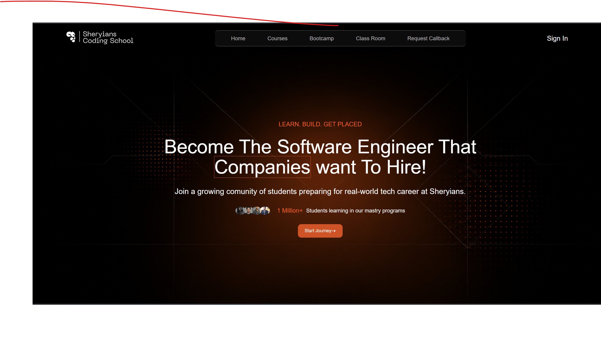

# 🎓 Sheryians Coding School Clone

A responsive clone of the **Sheryians Coding School** landing page built during **Sheryians Coding School Cohort 3.0**. This project was created as part of my frontend development journey to practice building responsive user interfaces and recreating real-world website designs using HTML and CSS.

## 🚀 Live Demo

🌐 **Live Website:**
https://moksh-max.github.io/Sheryians-clone/

---

## 📸 Preview



---

## ✨ Features

* 📱 Fully Responsive Design
* 🎨 Modern Landing Page UI
* 🎥 Hero Section with Video Background
* 🖼️ High-Quality Visual Assets
* ⚡ Clean and Organized Code
* 🌐 Cross-Browser Compatible

---

## 🛠️ Tech Stack

* HTML5
* CSS3

---

## 📂 Project Structure

```
Sheryians-clone/
│
├── assets/
│   ├── bg.png
│   ├── companiesLogo.png
│   ├── full-logo.webp
│   ├── herosection.webm
│   ├── img1.jpg
│   ├── img2.webp
│   ├── img3.webp
│   ├── img4.webp
│   ├── str.png
│   └── yt.png
│
├── index.html
├── style.css
└── README.md
```

---

## 🚀 Getting Started

### Clone the repository

```bash
git clone https://github.com/Moksh-max/Sheryians-clone.git
```

### Navigate to the project folder

```bash
cd Sheryians-clone
```

### Run the project

Simply open **index.html** in your preferred web browser.

---

## 📚 Learning Outcomes

This project helped me improve my understanding of:

* Semantic HTML
* CSS Layouts
* Flexbox
* Responsive Design
* UI Cloning
* Asset Management
* Project Structure

---

## 🎯 Project Purpose

This project was built as a practice assignment during **Sheryians Coding School Cohort 3.0**. The objective was to recreate the Sheryians Coding School landing page while applying modern frontend development concepts and improving attention to design details.

---

## ⭐ Support

If you found this project helpful or interesting, consider giving it a **⭐ Star** on GitHub.

---

## 👨‍💻 Author

**Moksh Saini**

* GitHub: https://github.com/Moksh-max
* LinkedIn: https://www.linkedin.com/in/moksh-saini/

---

## 📄 Disclaimer

This project is a **frontend clone** created **solely for educational and learning purposes** during **Sheryians Coding School Cohort 3.0**. All trademarks, logos, images, and design elements belong to their respective owners. No copyright infringement is intended.
